## Nama : Muhammad Rifai Aditiya 
## Nim : 312010065
## Kelas : TI.20.A1
## Mata Kuliah : Bahasa Pemrograman
## Pertemuan 9 lab7Web
 
# PHP Dasar

Dalam pertemuan ini kita akan mempelajari PHP Dasar dengan beberapa program code PHP nya.
# 1). Install XAMPP

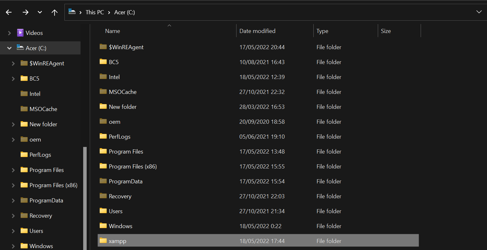
install XAMPP kemudian ekstrak file dan sesuaikan lokasi penyimpanannya.

# 2). Menjalankan XAMPP

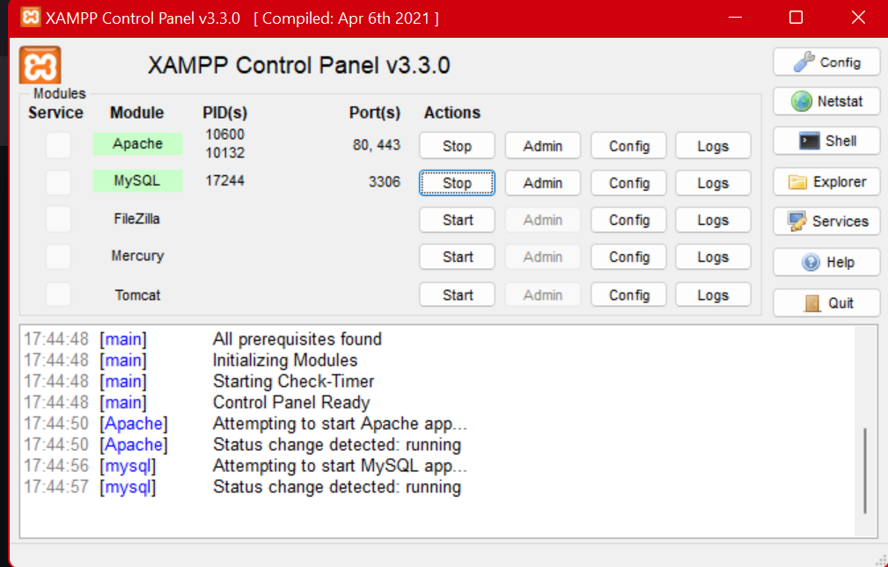

Menjalankan XAMPP dengan cara klik tombol Start pada server Apache seperti di gambar.

# 3). Memulai PHP

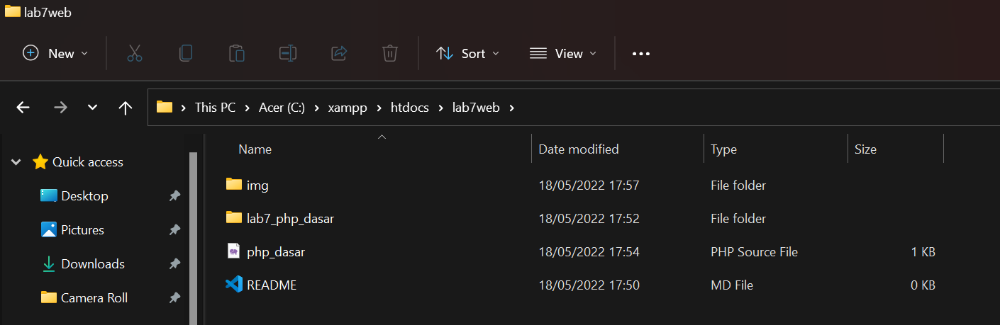

Buat folder lab7_php_dasar pada root directory web server (c:xampp/htdocs)

Kemudian akses directory pada web server dengan mengakses URL : http://localhost/Lab7Web/lab7_php_dasar/

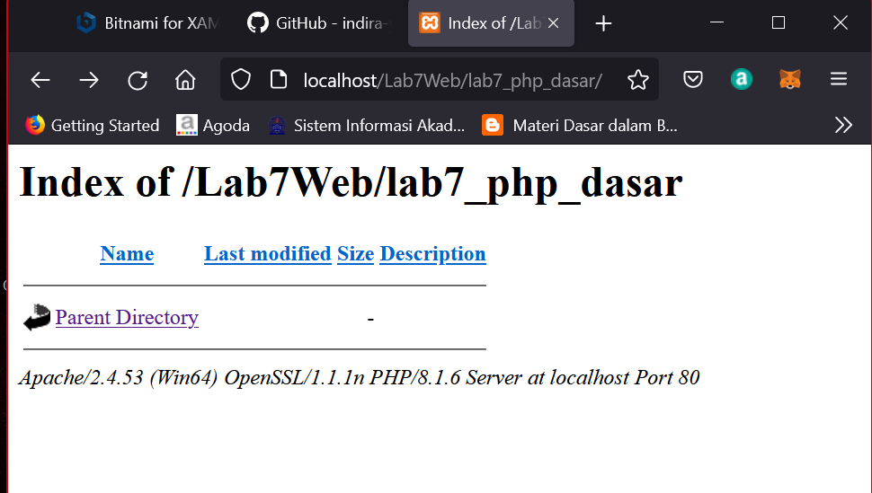

# 4).PHP DASAR

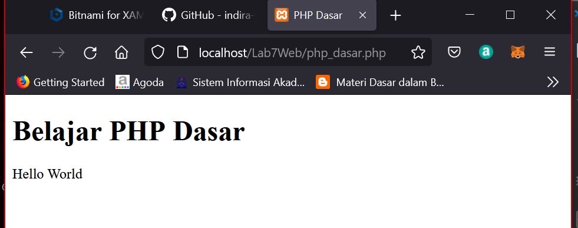

Berikut hasil run PHP Dasar
Contoh Coding
```html
<!DOCTYPE html>
<html lang="en">
<head>
    <meta charset="UTF-8">
    <meta http-equiv="X-UA-Compatible" content="IE=edge">
    <meta name="viewport" content="width=device-width, initial-scale=1.0">
    <title>PHP Dasar</title>
</head>
<body>
    <h1>Belajar PHP Dasar</h1>
    <?php
        echo "Hello World";
    ?>
```
# 5).Variabel PHP

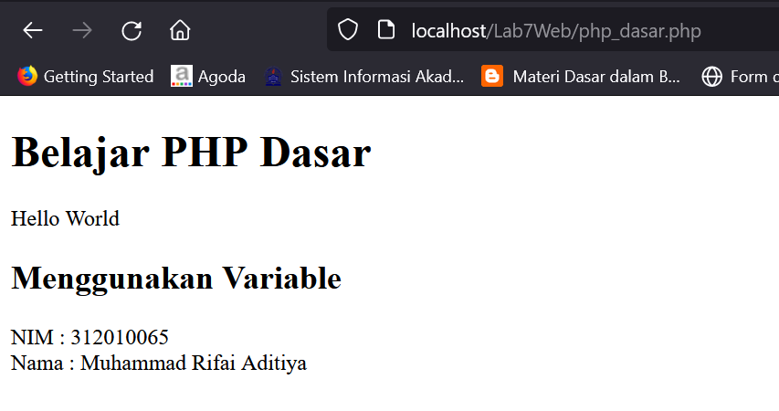

Berikut hasil run variabel pada program di PHP
Contoh Coding
```html
 <!-- Variabel PHP -->
    <h2>Menggunakan Variabel</h2>
    <?php
        $nim = "0411500400";
        $nama = 'Abdullah';
        echo "NIM : " . $nim . "<br>";
        echo "Nama : $nama";
    ?>
```
# 6).Predefine $_GET
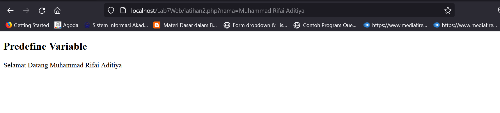
Buat file baru dalam directory lab7_php_dasar dengan nama filenya adalah latihan2.php dan untuk mengaksesnya menggunakan URL : http://localhost/Lab7Web/lab7_php_dasar/latihan2.php?nama=Muhammad Rifai Aditiya

Contoh Codingan
```html
<!DOCTYPE html>
<html lang="en">
<head>
    <meta charset="UTF-8">
    <meta http-equiv="X-UA-Compatible" content="IE=edge">
    <meta name="viewport" content="width=device-width, initial-scale=1.0">
    <title>PHP Dasar</title>
</head>
<body>
    <!-- Variabel $_GET -->
    <h2>Predefine Variabel</h2>
<?php
    echo 'Selamat Datang'. $_GET['nama'];
?>
</body>
</html>
```
# 7).Membuat Form input

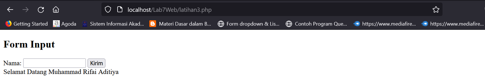

Buat File baru dengan nama latihan3.php dalam directory folder lab7_php_dasar

Berikut adalah hasil atau tampilan dalam membuat form dalam php dengan variable $_POST
Contoh Coding
```html
<!DOCTYPE html>
<html lang="en">
<head>
    <meta charset="UTF-8">
    <title>PHP Dasar</title>
</head>
<body>
<h2>Form Input</h2>
<form method="post">
    <label>Nama: </label>
    <input type="text" name="nama">
    <input type="submit" value="Kirim">
</form>
<?php
    echo 'Selamat Datang ' . $_POST['nama'];
?>
</body>
</html>
```
# 8).OPERATOR
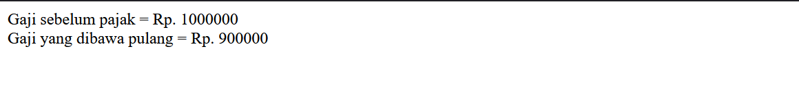
Membuat OPERATOR dalam php seperti contoh hasil tampilan di atas beserta code nya.
 # Contoh Coding
```html
<!DOCTYPE html>
<html lang="en">
<head>
    <meta charset="UTF-8">
    <meta http-equiv="X-UA-Compatible" content="IE=edge">
    <meta name="viewport" content="width=device-width, initial-scale=1.0">
    <title>PHP Dasar</title>
</head>
<body>
<?php
    $gaji = 1000000;
    $pajak = 0.1;
    $thp = $gaji - ($gaji*$pajak);
        echo "Gaji sebelum pajak = Rp. $gaji <br>";
        echo "Gaji yang dibawa pulang = Rp. $thp";
?>
</body>
</html>
```
# 9).Kondisi If
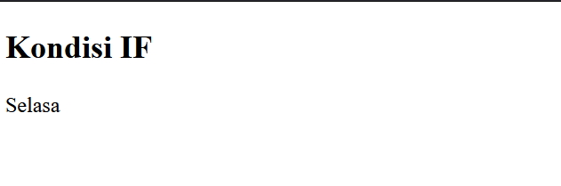
Pengondisian IF ELSE seperti hasil tampilan dan code digambar atas
# Contoh Coding
```html
<!DOCTYPE html>
<html lang="en">
<head>
    <meta charset="UTF-8">
    <meta http-equiv="X-UA-Compatible" content="IE=edge">
    <meta name="viewport" content="width=device-width, initial-scale=1.0">
    <title>PHP Dasar</title>
</head>
<body>
    <h2>Kondisi IF</h2>
<?php
    $nama_hari = date("l");
        if ($nama_hari == "Sunday") {
            echo "Minggu";
        } elseif ($nama_hari == "Monday") {
            echo "Senin";
        } else {
            echo "Selasa";
        }
?>
</body>
</html>
```
# 10).Kondisi switch
 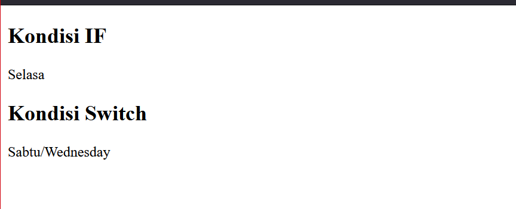

 Contoh penggunaan pengondisian SWICTH CASE dengan Break seperti contoh hasil diatas beserta code.
Contoh Coding
```html
 <h2>Kondisi Switch</h2>
<?php
    $nama_hari = date("l");
    switch ($nama_hari) {
        case "Sunday":
            echo "Minggu";
            break;
        case "Monday":
            echo "Senin";
            break;
        case "Tuesday":
            echo "Selasa";
            break;
        default:
            echo "Sabtu";
    }
    echo"/$nama_hari";
?>

```
# 11).Perulangan For


